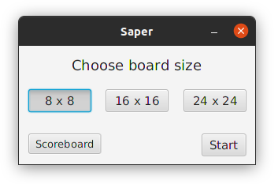
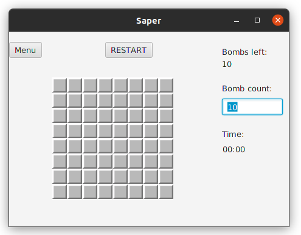
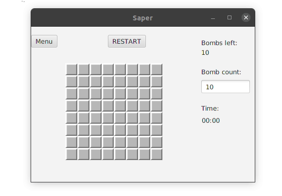
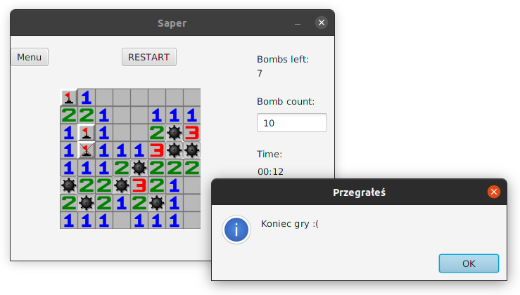
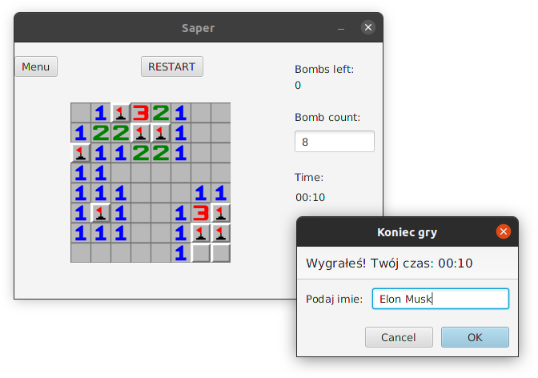
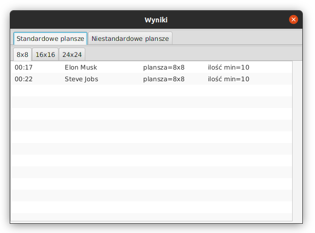
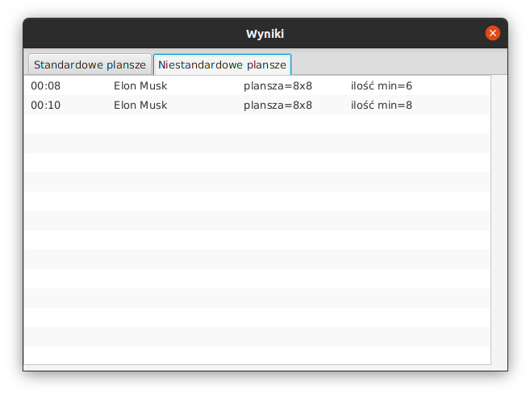
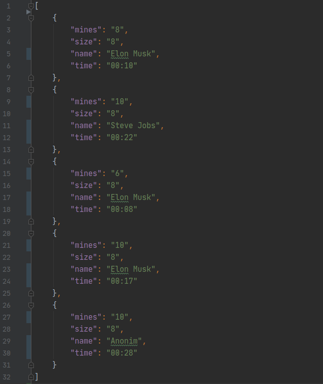

## Table of contents
* [Technologies](#technologies)
* [General info](#general-info)
* [Application description](#application-description)
* [JUnit](#junit)
	

## Technologies

 
 

## General info
Projekt stworzony w celach (zabicia nudy i) ćwiczenia Javy, Mavena oraz JUnit.

## Application description
Aplikacja jest implementacją klasycznej gry Minesweeper. 

Gracz ma możliwość wyboru 3 rozmiarów planszy:
* 8x8 (standardowo 10 min)
* 16x16 (standardowo 40 min)
* 24x24 (standardowo 130 min)

Dla każdej planszy można wybrać niestandardową liczbę min z przedziału <1, size*size/2>.

W grze zaimplementowane zostały wszystkie zasady klasycznego Minesweepera, oraz ułatwienia, 
jak stawianie min, otwieranie pusty pól jednym kliknięciem, czy odkrywanie bezpiecznego otoczenia pola, 
które już spełnia wymaganą liczbę otaczających min.

Przykładowa rozgrywka: 

Po oznaczeniu wszystkich min, bądź po odkryciu wszystkich pól bezpiecznych stoper przestaje mierzyć czas, 
a swój wynik można zapisać pod własnym pseudonimem:

Wyniki można przeglądać w oknie Scoreboard:

Wyniki zapisywane są w pamięci komputera w formacie Json, a następnie czytane do Scoreboard.

## JUnit

W celu ćwiczeniowym zostały napisane testy jednostkowe sprawdzające poprawne funkcjonowanie logiki gry.